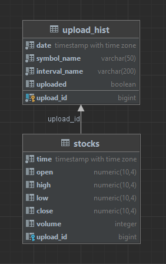
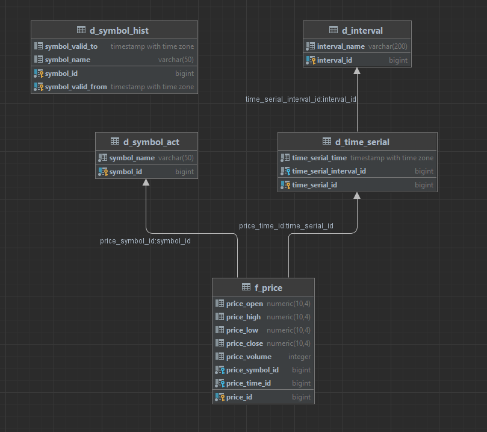
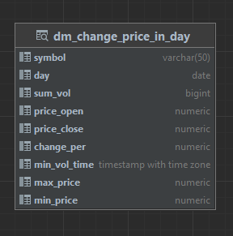

# Анализ рынка валют

### Общая задача: 
Ссоздать ETL-процесс формирования витрин данных для анализа изменений курса валют(акций).

Источники информации: https://www.alphavantage.co/

## Решение.

Разработаны скрипты загрузки данных в 2-х режимах:
- Инициализирующий – загрузка полного слепка данных источника
- Инкрементальный – загрузка дельты данных за прошедшие сутки

Организована структуру хранения данных:
- Сырой слой данных
- Промежуточный слой
- Слой витрин

В качестве результата работы программного продукта написан скрипт, который формирует витрину данных следующего содержания:
- Суррогатный ключ категории
- Название валюты
- Суммарный объем торгов за последние сутки
- Курс валюты на момент открытия торгов для данных суток
- Курс валюты на момент закрытия торгов для данных суток
- Разница(в %) курса с момента открытия до момента закрытия торгов для данных суток
- Минимальный временной интервал, на котором был зафиксирован самый крупный объем торгов для данных суток
- Минимальный временной интервал, на котором был зафиксирован максимальный курс для данных суток
- Минимальный временной интервал, на котором был зафиксирован минимальный курс торгов для данных суток

### Используемый стек.
При выборе используемого стека, для разработки ETL процесса, учитывались такие характеристики и требования, как:
- распространенность и популярность, так как это может повлиять на цену дальнейшего использования и сопровождения;
- адекватность применения инструментов и технологий к области решения ими задач;
- легкость переносимости и применения решения;
- простота применения, настройки и разработки.

Необходимые технологический стек, для разработки:
- СУБД, для хранения витрины данных;
- оркестратор ETL-пайплайна;
- система автоматизации развёртывания и управления разрабатываемого решения;
- язык программирования и фреймворки, для доступа к API и разработки ETL-пайплайна обработки данных;
- система визуализации данных.

Выбранный стек технологий:
- СУБД Postgresql;
- Airflow;
- Python(..);
- Metabase.

### Проектирование DWH.
В следствии постановки задачи в проектировании хранилища данных использован подход по Инмону с центральным слоем.

Используемы слои обработки данных:
- Операционный слой первичных данных (staging).
- Слой детальных интегрированных данных(ods).
- Витрина данных(cdm).

### Модель данных
Слой staging, трансформированных сырых данных:

Центральный слой:

Слой витрин:

Порядок загрузки объектов:
- Справочники
- Измерения
- Факты

### Правила трансформации данных

| Источник                        | Поля источника | Правило                            | Цель столбец | Целль таблица  |
|---------------------------------|----------------|------------------------------------|--------------|----------------|
| CSV файл                        |                |                                    |              | staging.stocks |
| (TIME_SERIES_INTRADAY_EXTENDED) |                |                                    |              |                |
|                                 | time           | Преобразование зоны времени в UTC. | time         |                |
|                                 | open           | =                                  | open         |                |
|                                 | high           | =                                  | high         |                |
|                                 | low            | =                                  | low          |                |
|                                 | close          | =                                  | close        |                |
|                                 | volume         | =                                  | volume       |                |
| JSON файл                       |                |                                    |              | staging.stocks |
| (TIME_SERIES_INTRADAY)          |                |                                    |              |                |
| "Time Series (5min)": {         |                |                                    |              |                |
|                                 | \<Time Serie\> | Преобразование зоны времени в UTC. | time         |                |
|                                 | "1. open"      | =                                  | open         |                |
|                                 | "2. high"      | =                                  | high         |                |
|                                 | "3. low"       | =                                  | low          |                |
|                                 | "4. close"     | =                                  | close        |                |
|                                 | "5. volume"    | =                                  | volume       |                |

# ETL-пайплайн.

При старте docker compose создаются таблицы и вью модели данных.

Последовательность реализованных в решении действий:
1. Выполнение через API запроса на выгрузку файлов с данными в локальное хранилище;
2. Трансформация файла: трансформация в табличный вид Postgres, перевод времени из US/Eastern в UTC и порционная загрузка методами Python;
3. Обновление таблиц измерений и фактов;

### Порядок загрузки объектов.
В разработанной модели данных имеет значения порядок загрузки данных в БД.
В рассматриваем решении порядок загрузки объектов следующий:
- сведения о параметрах загрузки в staging слое;
- справочники и измерения - интервал времени выгрузки, тикеры акции, штамп времени среза;
- факты - цена открытия, закрытия, минимального и максимального значения цены акции во времени, объём.

### Проектирование системы восстановления на основе требований
Перед загрузкой данных таблицы дополнительный шаг проверки. Это необходимое действие, которое позволит пропускать уже загруженные объекты.

### Медленно меняющееся измерение.
Так как тикеры подвержены смене названия, то для символов тикеров добавлена поддержка история изменения по SCD4 - таблица d_symbol_hist.

### Контроль качества данных
Контроль качества исполнен в виде sql скриптов сверки количества строк и агрегаций по полям.

# Порядок запуска проекта.
1. Проект в папке solution.
2. Создать и задать переменные окружения в файле .env, по примеру env.example
3. Поднять docker compose:
   make start или docker compose --env-file ./.env up -d
4. Инициализировать соединения, переменные и админа в airflow:
   make init или аналогично.
5. Запустить даги.
6. По завершению работы зайти в интерфейс metabase, подключиться к БД(host: db-etl и логин из .env) и строить графики.
